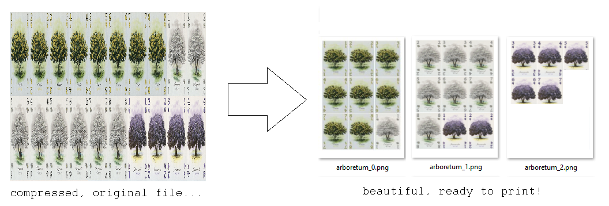
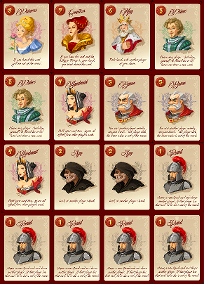

# print n' play scripts
Transform files with tons of cards into ready-to-print A4



## Dependencies

You must have [Pillow](https://pillow.readthedocs.io/en/stable/index.html) module installed. You can install it with `pip` by simply running:
```
python -m pip install Pillow
```

## Usage

Put your images in `data` folder and edit `files.json` accordingly. Then, just run `script.py`.

## Settings

These are the settings configurable in `files.json`:

- `game`: the name of the game. Relevant when saving as PDF.
- `a4_pix`: the size (in pixels) of the final A4 file that you want. All final files will have these dimensions. Should be proportional to `a4_dim`. Example: `[2480, 3508]`.
- `a4_dim`: the size (in millimeters) of an A4 paper. Trivially the value is `[210, 297]`, but you may want to change this if printing in another kind of paper.
- `save_as_pdf`: boolean. If true, will save the results in a single PDF; otherwise, as a series of PNG images. **Warning: saving a PDF with lots of heavy files may slow down your computer.**
- `output_path`: the folder in which the processed files will be exported, relative to current path. Example: `data/exported`.
- `card_files`: array with information pertaining to groups of files.
  - `name`: name of the group of files. This will be used in the saving step: if `name` is "characters", then the exported files will be "characters_0.png", "characters_1.png", etc.
  - `rotate`: boolean. If true, cards will be positioned horizontally instead of vertically. Only relevant if `bestFit` is set to false.
  - `bestFit`: boolean. If true, will try to fit as many cards as possible in each A4 page, rotating them if necessary. Useful to save space. Overrides `rotate`.
  - `margin_mm`: makes sure that the cards will be offset by a certain margin in the final A4 file. For example, if `margin_mm` equals `[10, 10]`, there will be empty 10mm in each of the four borders of the final A4 files.
  - `padding_mm`: sets the space in millimeters between the cards themselves. A value of `[1, 2]` means a space of 1mm between horizontally adjacent cards, and 2mm between vertically adjacent cards. Should be set to `[0, 0]` if original cards file already has some padding.
  - `card_dim`: the dimensions (in millimeters) that the cards should have. For a standard deck of cards, this should be `[63, 88]`. When you print the final A4 files, the cards *will* have these dimensions (if you make sure the printer doesn't add any additional margins).
  - `fileData`: array with information pertaining to individual files.
    - `filename`: path to file.
    - `card_count`: the distribution of cards in the file. Example: if the file has 20 cards spread in 4 columns and 5 rows, this should be `[4, 5]`.
    - `instances`: how many instances should this file have in the final A4 files? Trivially it should be `1`, but there are many situations where the back of the cards is provided in a separate file, and you want to print this not only once, but N times (N being the number of cards). In these cases, `instances` is the parameter you want to tweak. If you don't include this parameter, it defaults to 1.
    - `select`: which cards in the file should be considered. This is passed as an array of arrays, in which every inner array represents a certain range to consider. The range is inclusive. For example, `[[0, 1], [8, 8]]` will extract cards from index 0 to 1, and concatenate the result with the cards extracted from index 8 to 8. In other words, the only cards extracted will be the 1st, the 2nd and the 9th - the rest will be ignored.
    - `maintain_w_or_h`: controls how the file will be scaled. If you want to scale it vertically, set it to 0. Otherwise, if you want to scale it horizontally, set it to 1. This has practically no effect in the final result, but it changes the resolution with which the file will be treated internally. If not sure, set this to 1.
    
## Example 1

For the first example, we'll use the reskin made by Konstantin Sokolov ([kotdesign](https://boardgamegeek.com/user/kotdesign)) for the game *Love Letter* (2012). We'll feed the script with the following image:



The cards will need to be unstretched and separated across multiple PDF pages. The script will take care of that for us. This is the corresponding `files.json`:

```jsonc
{
    "game": "love letter",
    "a4_pix": [2480, 3508],
    "a4_dim": [210, 297],
    "outputPath": "data\\exported\\",
    "save_as_pdf": true,
    "card_files": [
        {
            "name": "cards",
            "rotate": false,
            "bestFit": true,
            "margin_mm": [2, 2], 
            "padding_mm": [0, 0], //original image already has plenty of space between cards
            "card_dim": [63, 88], //Google tells us these are the dimensions of a Love Letter card
            "fileData": [
                {
                    "filename": "data\\love_letter.jpg",
                    "card_count": [4, 4],
                    "maintain_w_or_h": 1
                }
            ]
        }
    ]
}
```

## Example 2

For our second example, we'll use the same Love Letter reskin cards, but in a different format. Let's suppose that, instead of 'ready-to-print', the file is arranged in such a way that every card appears only once: 


As seen in the first example, in Love Letter there are 8 different cards, but some of them appear more than once. These are their frequencies:

1. Princess: 1
2. Countess: 1
3. King: 1
4. Prince: 2
5. Handmaid: 2
6. Baron: 2
7. Spy: 2
8. Guard: 5

With that in mind, this is the corresponding JSON:

```jsonc
{
    "game": "love letter",
    "a4_pix": [2480, 3508],
    "a4_dim": [210, 297],
    "outputPath": "data\\exported\\",
    "save_as_pdf": true,
    "card_files": [
        {
            "name": "cards",
            "rotate": false,
            "bestFit": true,
            "margin_mm": [10, 10],
            "padding_mm": [1, 1],
            "card_dim": [63, 88],
            "fileData": [
                {
                    "filename": "data\\love_letter.jpg",
                    "card_count": [3, 3],
                    "select": [[7, 7]], //select the Princess
                    "instances": 1, //repeat it once
                    "maintain_w_or_h": 1
                },
                {
                    "filename": "data\\love_letter.jpg",
                    "card_count": [3, 3],
                    "select": [[6, 6]], //select the Countess, repeat it once (by default, 'instances' is 1)
                    "maintain_w_or_h": 1
                },
                {
                    "filename": "data\\love_letter.jpg",
                    "card_count": [3, 3],
                    "select": [[5, 5]], //select the King, repeat it once
                    "maintain_w_or_h": 1
                },
                {
                    "filename": "data\\love_letter.jpg",
                    "card_count": [3, 3],
                    "select": [[4, 4]], //select the Prince
                    "instances": 2, //repeat it 2 times
                    "maintain_w_or_h": 1
                },
                {
                    "filename": "data\\love_letter.jpg",
                    "card_count": [3, 3],
                    "select": [[3, 3]], //select the Handmaid
                    "instances": 2, //repeat it 2 times
                    "maintain_w_or_h": 1
                },
                {
                    "filename": "data\\love_letter.jpg",
                    "card_count": [3, 3],
                    "select": [[2, 2]], //select the Baron
                    "instances": 2, //repeat it 2 times
                    "maintain_w_or_h": 1
                },
                {
                    "filename": "data\\love_letter.jpg",
                    "card_count": [3, 3],
                    "select": [[1, 1]], //select the Spy
                    "instances": 2, //repeat it 2 times
                    "maintain_w_or_h": 1
                },
                {
                    "filename": "data\\love_letter.jpg",
                    "card_count": [3, 3],
                    "select": [[0, 0]], //select the Guard
                    "instances": 5, //repeat it 5 times
                    "maintain_w_or_h": 1
                }
            ]
        }
    ]
}
```
